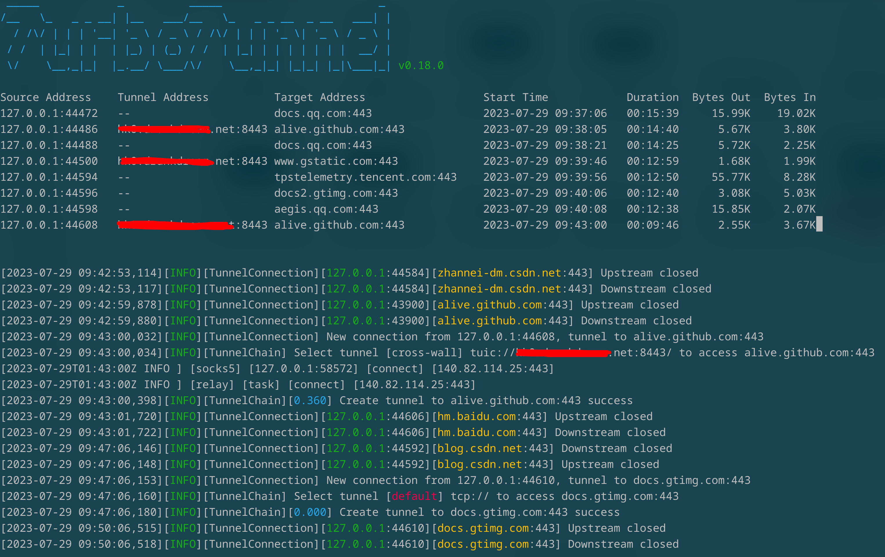

# 插件支持

## 插件是什么

turbo-tunnel插件主要用于对turbo-tunnel能力的扩展，例如：支持更多的第三方/自定义隧道协议；提供流量分析、流量劫持等功能。

## 如何使用插件

turbo-tunnel插件本质上就是一个python库，在turbo-tunnel命令行中可以使用`-p/--plugin`参数加载指定的插件包名。

例如，对于内置插件`terminal`，可以使用以下命令加载：

```bash
$ turbo-tunnel -l http://127.0.0.1:8888/ -p terminal
```

此时，界面展示会变成实时状态模式（默认为日志模式）：



## 如何实现插件

由于turbo-tunnel是基于`asyncio`、`tornado`等库开发，因此，插件也必须使用`asyncio`，以保证整体的兼容。

### 支持第三方隧道/自定义隧道

1、 实现`隧道客户端`（继承自`turbo_tunnel.tunnel.Tunnel`或其子类），并且将其注册到turbo-tunnel中。下面以SSH隧道为例：

```python
turbo_tunnel.registry.tunnel_registry.register("ssh", SSHTunnel)
```

在代码顶层执行以上代码，即可注册SSH隧道。这里的`ssh`表示使用的协议，不同的隧道类型应当使用不同的协议。

> 这里需要在代码顶层执行以上代码，是为了在加载插件时自动注册，否则会导致无法使用指定的隧道。

2、 实现`隧道服务端`

隧道服务端不是必需的，因为有些隧道服务已经有很好的实现了，例如`SSH Server`。对于这种情况，可以不提供隧道服务端。

对于自定义隧道，就需要自己实现隧道服务端了，它一般是继承自`turbo_tunnel.server.TunnelServer`，并且实现了`start`方法，用于开启服务。在接收到请求后，会根据指定的路由或策略配置动态选择路由，并进行请求的转发。

### 提供流量分析、处理能力

插件定义了如下一些回调接口，在特定事件发生时通知到插件：

```python
class Plugin(object):
    def on_load(self):
        pass

    def on_unload(self):
        pass

    def on_tunnel_selected(self, address, rule, tunnel):
        pass

    def on_new_connection(self, connection):
        pass

    def on_tunnel_address_updated(self, connection, tunnel_address):
        pass

    def on_data_recevied(self, connection, buffer):
        pass

    def on_data_sent(self, connection, buffer):
        pass

    def on_connection_closed(self, connection):
        pass
```

插件可以基于这些接口执行一些操作，例如抓包、分析流量等工作；目前尚不支持修改数据包，等后面支持了，就可以执行流量修改等操作了。
